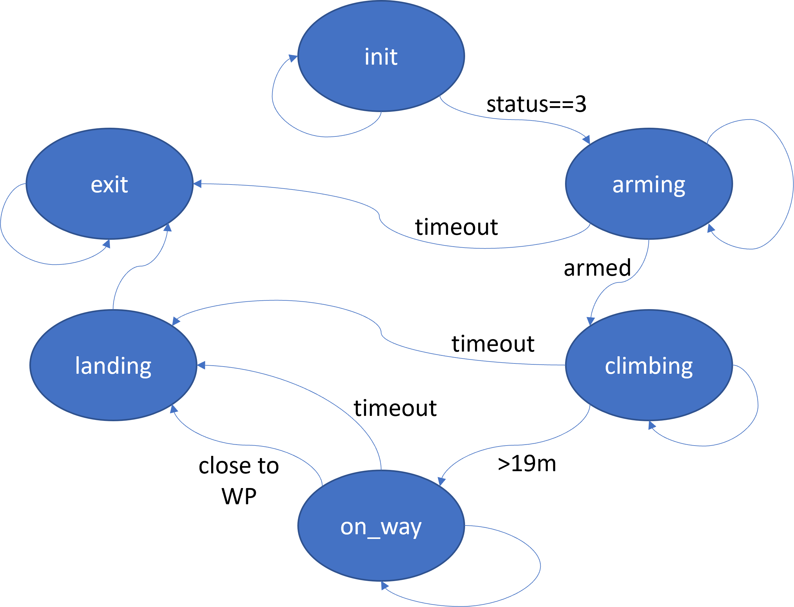

# Finite state machine

[Back to tutorial contents](README.md#contents)

## Introduction

Our control flow is relatively simple in this example, just carrying on regardless.  As solutions grow in complexity and the number of execution paths increases, it becomes much harder to write such control logic as code.  You end up with loads of nested `if` statements and repeated tests.  A common approach to handling this is to implement the logic as a [finite state machine](https://en.wikipedia.org/wiki/Finite-state_machine).



The figure above shows an implementation of our control flow as a finite state machine.  The ovals represent the six _states_ and the system must be in one of these at all times.  The arrows denote _transitions_.  Where an arrow has text, that represents the condition for making that transition.  If an arrow has now text, that represents 'all other cases'.

The system will always start in the `init` state, moving to `arming` if the reported status reaches 'standby' (value 3) and remaining in `init` otherwise.  In `arming`, arm commands will regularly be sent.  If the drone takes too long to respond, the system will move to `exit` state (now handling the timeout cases properly), or if it does successfuly arm, it will move to `climbing` (issuing the take-off command on the transition), or stay in `arming` otherwise.  From `climbing` it will send the target command and move to `on_way` on reaching altitude, move to `landing` if too much time elapses, or remain `climbing` otherwise.  From the `on_way` state, either timing out or reaching the target will trigger a move to `landing`.  The `landing` state does nothing more than issue an "RTL" command and then immediately move state to `exit`, from where there is no further change as the only transition out is to stay in `exit`.

[Back to tutorial contents](README.md#contents)

## Example code

To run this example, use the command:
```
docker-compose -f docker-compose-finite-state.yml up --build
```
The key file is [fenswood_drone_controller/fenswood_drone_controller/controller_finite_state.py](../fenswood_drone_controller/fenswood_drone_controller/controller_finite_state.py).  The remainder of this section describes how it works.  As ever, only the changes from the previous [modular version](modular.md#example-code) are highlighted.

```
import rclpy                                                    # type: ignore
from rclpy.node import Node

# import message definitions for receiving status and position
from mavros_msgs.msg import State                               # type: ignore
from sensor_msgs.msg import NavSatFix                           # type: ignore
# import message definition for sending setpoint
from geographic_msgs.msg import GeoPoseStamped                  # type: ignore

# import service definitions for changing mode, arming, take-off and generic command
from mavros_msgs.srv import SetMode, CommandBool, CommandTOL, CommandLong    # type: ignore


class FenswoodDroneController(Node):

    def __init__(self):
        super().__init__('example_controller')
        self.last_status = None     # global for last received status message
        self.last_pos = None       # global for last received position message
        self.init_alt = None       # global for global altitude at start
        self.last_alt_rel = None   # global for last altitude relative to start
        # create service clients for long command (datastream requests)...
        self.cmd_cli = self.create_client(CommandLong, 'mavros/cmd/command')
        while not self.cmd_cli.wait_for_service(timeout_sec=1.0):
            self.get_logger().info('command_int service not available, waiting again...')
        # ... for mode changes ...
        self.mode_cli = self.create_client(SetMode, 'mavros/set_mode')
        while not self.mode_cli.wait_for_service(timeout_sec=1.0):
            self.get_logger().info('set_mode service not available, waiting again...')
        # ... for arming ...
        self.arm_cli = self.create_client(CommandBool, 'mavros/cmd/arming')
        while not self.arm_cli.wait_for_service(timeout_sec=1.0):
            self.get_logger().info('arming service not available, waiting again...')
        # ... and for takeoff
        self.takeoff_cli = self.create_client(CommandTOL, 'mavros/cmd/takeoff')
        while not self.takeoff_cli.wait_for_service(timeout_sec=1.0):
            self.get_logger().info('takeoff service not available, waiting again...')
        # create publisher for setpoint
        self.target_pub = self.create_publisher(GeoPoseStamped, 'mavros/setpoint_position/global', 10)
        # and make a placeholder for the last sent target
        self.last_target = GeoPoseStamped()
        # initial state for finite state machine
        self.control_state = 'init'
        # timer for time spent in each state
        self.state_timer = 0
```
The last two statements are new to the `__init__` controller constructor.  `self.control_state` will record the current state of the system and, as described in the logic above, will be `init` to begin.  the `state_timer` will hold the time spent in each state, facilitating the timeout transitions (see later). 
```
    # on receiving status message, save it to global
    def state_callback(self,msg):
        self.last_status = msg
        self.get_logger().debug('Mode: {}.  Armed: {}.  System status: {}'.format(msg.mode,msg.armed,msg.system_status))

    # on receiving positon message, save it to global
    def position_callback(self,msg):
        # determine altitude relative to start
        if self.init_alt:
            self.last_alt_rel = msg.altitude - self.init_alt
        self.last_pos = msg
        self.get_logger().debug('Drone at {}N,{}E altitude {}m'.format(msg.latitude,
                                                                        msg.longitude,
                                                                        self.last_alt_rel))

    def wait_for_new_status(self):
        """
        Wait for new state message to be received.  These are sent at
        1Hz so calling this is roughly equivalent to one second delay.
        """
        if self.last_status:
            # if had a message before, wait for higher timestamp
            last_stamp = self.last_status.header.stamp.sec
            for try_wait in range(60):
                rclpy.spin_once(self)
                if self.last_status.header.stamp.sec > last_stamp:
                    break
        else:
            # if never had a message, just wait for first one          
            for try_wait in range(60):
                if self.last_status:
                    break
                rclpy.spin_once(self)

    def request_data_stream(self,msg_id,msg_interval):
        cmd_req = CommandLong.Request()
        cmd_req.command = 511
        cmd_req.param1 = float(msg_id)
        cmd_req.param2 = float(msg_interval)
        future = self.cmd_cli.call_async(cmd_req)
        rclpy.spin_until_future_complete(self, future)    # wait for response

    def change_mode(self,new_mode):
        mode_req = SetMode.Request()
        mode_req.custom_mode = new_mode
        future = self.mode_cli.call_async(mode_req)
        rclpy.spin_until_future_complete(self, future)    # wait for response

    def arm_request(self):
        arm_req = CommandBool.Request()
        arm_req.value = True
        future = self.arm_cli.call_async(arm_req)
        rclpy.spin_until_future_complete(self, future)

    def takeoff(self,target_alt):
        takeoff_req = CommandTOL.Request()
        takeoff_req.altitude = target_alt
        future = self.takeoff_cli.call_async(takeoff_req)
        rclpy.spin_until_future_complete(self, future)

    def flyto(self,lat,lon,alt):
        self.last_target.pose.position.latitude = lat
        self.last_target.pose.position.longitude = lon
        self.last_target.pose.position.altitude = alt
        self.target_pub.publish(self.last_target)
        self.get_logger().info('Sent drone to {}N, {}E, altitude {}m'.format(lat,lon,alt)) 
```
The above utilities are unchanged - they will be called by different logic, but their operation remains the same.

> A _really_ good style would probably package these up in a separate file as a module, as they are quite distinct and self-contained. 
```
    def state_transition(self):
        if self.control_state =='init':
            if self.last_status.system_status==3:
                self.get_logger().info('Drone initialized')
                # send command to request regular position updates
                self.request_data_stream(33, 1000000)
                self.get_logger().info('Requested position stream')
                # change mode to GUIDED
                self.change_mode("GUIDED")
                self.get_logger().info('Request sent for GUIDED mode.')
                # move on to arming
                return('arming')
            else:
                return('init')

        elif self.control_state == 'arming':
            if self.last_status.armed:
                self.get_logger().info('Arming successful')
                # armed - grab init alt for relative working
                if self.last_pos:
                    self.init_alt = self.last_pos.altitude
                # send takeoff command
                self.takeoff(20.0)
                self.get_logger().info('Takeoff request sent.')
                return('climbing')
            elif self.state_timer > 60:
                # timeout
                self.get_logger().error('Failed to arm')
                return('exit')
            else:
                self.arm_request()
                self.get_logger().info('Arming request sent.')
                return('arming')

        elif self.control_state == 'climbing':
            if self.last_alt_rel > 19.0:
                self.get_logger().info('Close enough to flight altitude')
                # move drone by sending setpoint message
                self.flyto(51.423, -2.671, self.init_alt - 30.0) # unexplained correction factor on altitude
                return('on_way')
            elif self.state_timer > 60:
                # timeout
                self.get_logger().error('Failed to reach altitude')
                return('landing')
            else:
                self.get_logger().info('Climbing, altitude {}m'.format(self.last_alt_rel))
                return('climbing')

        elif self.control_state == 'on_way':
            d_lon = self.last_pos.longitude - self.last_target.pose.position.longitude
            d_lat = self.last_pos.latitude - self.last_target.pose.position.latitude
            if (abs(d_lon) < 0.0001) & (abs(d_lat) < 0.0001):
                self.get_logger().info('Close enough to target delta={},{}'.format(d_lat,d_lon))
                return('landing')
            elif self.state_timer > 60:
                # timeout
                self.get_logger().error('Failed to reach target')
                return('landing')
            else:
                self.get_logger().info('Target error {},{}'.format(d_lat,d_lon))
                return('on_way')
            
        elif self.control_state == 'landing':
            # return home and land
            self.change_mode("RTL")
            self.get_logger().info('Request sent for RTL mode.')
            return('exit')

        elif self.control_state == 'exit':
            # nothing else to do
            return('exit')
```
THe `state_transition` function implements the logic described in the text and diagram above.  The structure is typical of a finite state machine implementation: each finite state has its own 'clause' in a big `if...elif...elif` statement (C would do it as a `switch...case...`).  Thus it is easy to see where the code for each state lives, and to make changes if needed.

Note the _actions_ (_e.g._ sending commands) typically appear in the transitions.  For example, in the `init` state, the datastream request and the change of mode appear right before the state is updated to `arming`.  Then in the `arming` state, the actual command to arm appears in the (null) transition to stay in `arming`.  Hence the arm command will be issued over and over until success is detected.
```
    def run(self):
        # set up two subscribers, one for vehicle state...
        state_sub = self.create_subscription(State, 'mavros/state', self.state_callback, 10)
        # ...and the other for global position
        pos_sub = self.create_subscription(NavSatFix, 'mavros/global_position/global', self.position_callback, 10)
        for try_loop in range(600):
            if rclpy.ok():
                self.wait_for_new_status()
                new_state = self.state_transition()
                if new_state == self.control_state:
                    self.state_timer = self.state_timer + 1
                else:
                    self.state_timer = 0
                self.control_state = new_state
                self.get_logger().info('Controller state: {} for {} steps'.format(self.control_state, self.state_timer))
```
With each iteration of this code, the `run()` method does less and less.  With the control logic now handled in its own `state_transition` function, `run` just starts the subscribers as before and manages the state and the timer.  The `self.state_timer` counter is incremented each time, unless the state changes in which case it is reset.
```

def main(args=None):
    
    rclpy.init(args=args)

    controller_node = FenswoodDroneController()
    controller_node.run()


if __name__ == '__main__':
    main()
```
Main and the Python bit at the end remain unchanged.


## Exercises

All exercises work involve editing the file `controller_finite_state.py`.

1. Add a second target and fly to it only if you reach the first target within a limited time, or (b) if you fail to reach the first target in time.

2. Add an extra initial target, but make it very far away.  When you don't reach it in a sensible time, divert back to your original target.

3. Add a human 'approve' input.  When you get to altitude, ask the operator (in the log) if they are happy to proceed, and fly to the target only if they approve.  For input, you can define your own ROS topic and have them publish through Foxglove, or re-purpose the tele-op gamepad buttons to publish to a different topic, or just ask the operator to wiggle the camera.  Test all cases you can think of: operator says 'yes' when asked, operator says 'no' when asked, operator says nothing, operator has said 'yes' but before being asked, _etc._

4. Add a human 'pause' input.  Define a button, topic or some other signal, and make the drone stop and hover if the operator requests it.  There are lots of ways of implementing this, including mode changes or extra control logic.  Don't forget you can connect QGroundControl to the simulation via localhost, TCP port 5761, if you want the operator to interact that way.

[Back to tutorial contents](README.md#contents)
