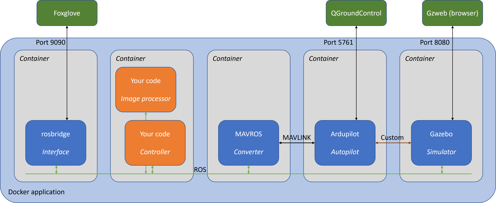

# Brief outline of the Starling framework

The template is built on the [Starling](https://github.com/StarlingUAS) framework which combines open-source components to provide a realistic, cross-platform simulation for drone flight:
 - [Gazebo](http://gazebosim.org/), a physical and visual simulation package
 - [Ardupilot](https://ardupilot.org/), a free autopilot software with [MAVLINK](https://mavlink.io/en/) interfacing and [simulation](https://ardupilot.org/copter/docs/common-simulation.html) capability
 - [ROS](https://www.ros.org/), a popular software framework for robot interfacing, plus the [MAVROS](http://wiki.ros.org/mavros) package for connecting MAVLINK drones to ROS. 
 - [OpenCV](https://opencv.org/), an image processing library with Python support
 - [Docker](https://www.docker.com/), a system for packaging and deploying 

> Surely there's a simpler way?  Almost certainly, but you wouldn't learn so much.  These are the standard tools of the robotics trade, and while it'll take you a while to learn them, the skills you get will go far beyond this project.  This way also means we can do more with Starling, like migrate controllers from simulation to actual flight.

Starling uses [Docker](https://www.docker.com/) to package up the simulation framework for use on different computers.  I found the [Duckietown introduction](https://docs.duckietown.org/DT19/software_devel/out/docker_intro.html) really good for getting a feel for Docker.  The `docker-compose up --build` command that starts the simulation actually launches a set of _containers_ on your computer, a bit like a set of virtual computers all networked together.  The file `docker-compose.yml` (which you will not need to edit) provides the 'recipe' for what containers to run.  In our case there are five, illustrated in the figure above.

- [Gazebo](http://gazebosim.org/), the physics simulator.  Given commands from the autopilot, it simulates how the drone moves.  Gazebo also provides graphics, simulating the drone cemra feed and sending it to ROS, and providing a representation of the world for us to spy on via the browser interface on `localhost:8080`.

_Work in progress_